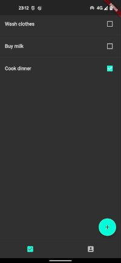
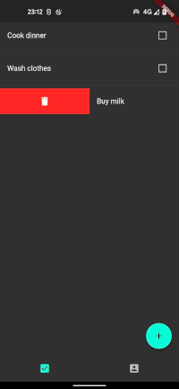
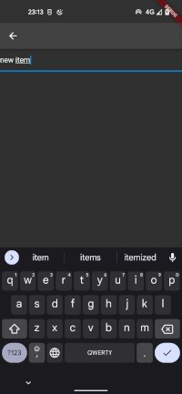
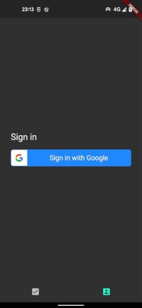

# todo

A simple todo list in flutter, just to play around

## Features

* Uses firebase auth to manage users
* Uses firebase realtime database to store user tasks
* builds apk on push
* builds web on push and publishes on firebase hosting: [link](https://todo-flutter-349512.web.app/)

## Screenshots

* Todo List

* Swpie right to mark as done

* Swpie left to mark as done

* Adding new task

* login page

* profile page

